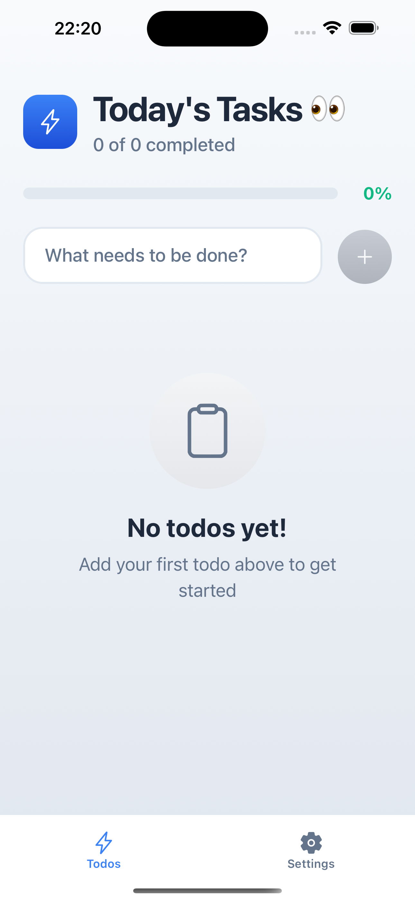
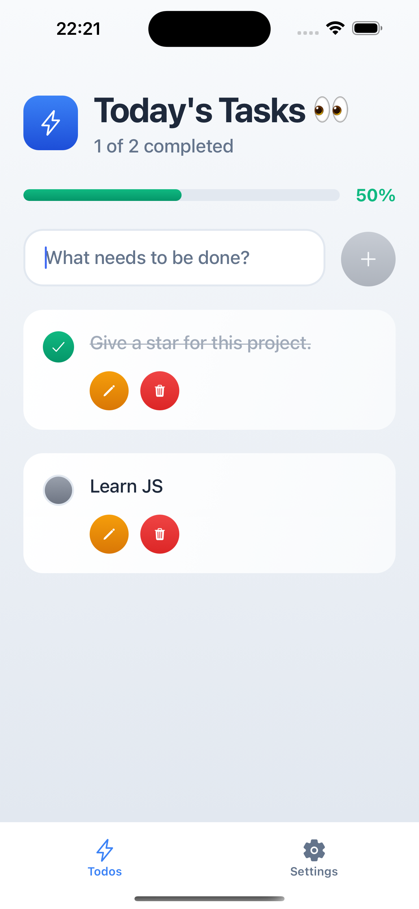
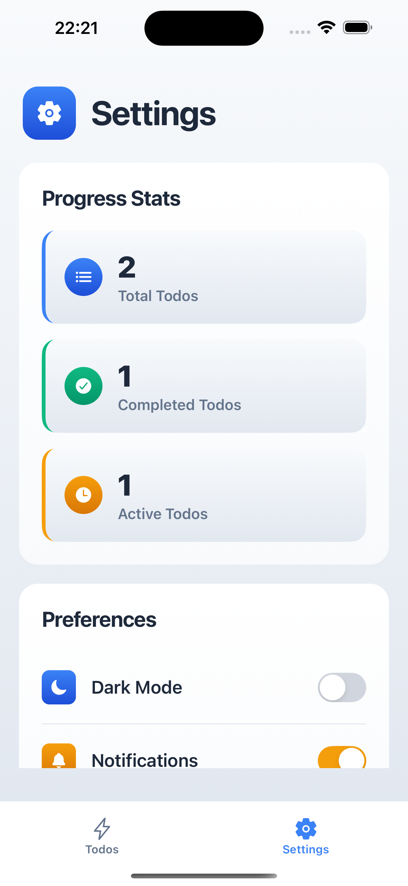
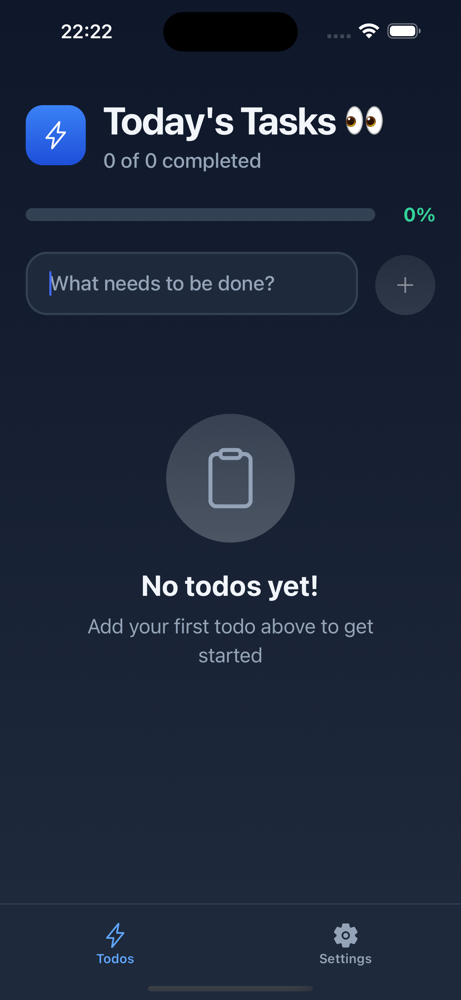
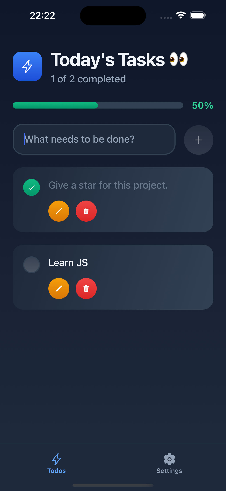
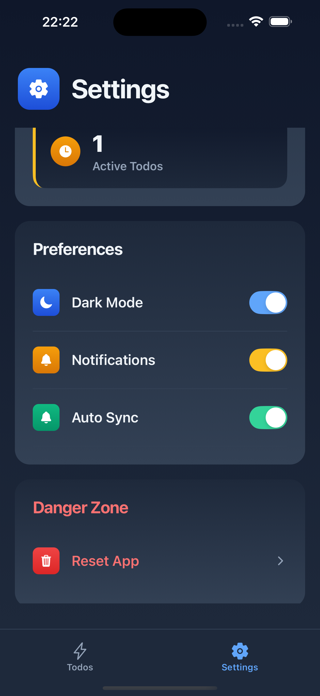

# 📱 Todo App React Native

Modern, responsive ve gerçek zamanlı bir Todo uygulaması. React Native, Expo ve Convex kullanılarak geliştirilmiştir.

## ✨ Özellikler

- ✅ **Todo Yönetimi**: Görev ekleme, düzenleme, silme ve tamamlama
- 🌓 **Tema Desteği**: Dark/Light mode arası geçiş
- 📊 **İlerleme Takibi**: Tamamlanan görevlerin görsel takibi
- ⚡ **Real-time Sync**: Convex ile gerçek zamanlı veri senkronizasyonu
- 📱 **Cross-platform**: iOS, Android ve Web desteği
- 🎨 **Modern UI**: Linear gradients ve smooth animasyonlar
- 🔧 **Settings**: Kullanıcı tercihleri ve uygulama ayarları

## 🛠 Teknolojiler

- **Frontend**: React Native 0.79.5, TypeScript
- **Framework**: Expo 53.0.20
- **Navigation**: Expo Router (File-based routing)
- **Backend**: Convex (Real-time database)
- **UI**: Linear Gradients, Custom Styling
- **State Management**: Convex React hooks

## 📸 Screenshots

### 🌅 Light Mode

<div align="center">
  
  
  
</div>

### 🌙 Dark Mode

<div align="center">
  
  
  
</div>

## 🚀 Kurulum ve Çalıştırma

### Gereksinimler

- Node.js 18+
- npm veya yarn
- Expo CLI
- Convex hesabı

### 1. Projeyi klonlayın

```bash
git clone https://github.com/AdylshaY/rn-todo-app.git
cd rn-todo-app
```

### 2. Bağımlılıkları yükleyin

```bash
npm install
```

### 3. Convex kurulumu

```bash
npx convex dev
```

### 4. Environment variables

`.env.example` dosyasını `.env` olarak kopyalayın ve Convex bilgilerini ekleyin:

```env
CONVEX_DEPLOYMENT=your-convex-deployment
EXPO_PUBLIC_CONVEX_URL=your-convex-url
```

### 5. Uygulamayı başlatın

```bash
npx expo start
```

Uygulamayı şu platformlarda çalıştırabilirsiniz:

- 📱 **iOS Simulator** - `i` tuşuna basın
- 🤖 **Android Emulator** - `a` tuşuna basın
- 🌐 **Web Browser** - `w` tuşuna basın
- 📲 **Expo Go** - QR kod ile cihazınızda

## 📁 Proje Yapısı

```
├── app/                    # Expo Router sayfaları
│   ├── (tabs)/            # Tab navigation
│   │   ├── index.tsx      # Ana todo sayfası
│   │   └── settings.tsx   # Ayarlar sayfası
│   └── _layout.tsx        # Root layout
├── components/            # Yeniden kullanılabilir bileşenler
│   ├── todo-input.tsx     # Todo ekleme bileşeni
│   ├── header.tsx         # Başlık ve progress bar
│   ├── empty-state.tsx    # Boş durum gösterimi
│   ├── progress-stats.tsx # İstatistik kartları
│   ├── preferences.tsx    # Kullanıcı tercihleri
│   └── danger-zone.tsx    # Kritik işlemler
├── convex/                # Backend fonksiyonları
│   ├── schema.ts          # Veritabanı şeması
│   └── todos.ts           # Todo CRUD işlemleri
├── hooks/                 # Custom hooks
│   └── useTheme.tsx       # Tema yönetimi
└── assets/                # Stil dosyaları ve görseller
    └── styles/            # Component stilleri
```

## 🔧 Kullanılabilir Komutlar

```bash
# Geliştirme sunucusunu başlat
npm start

# Platform-specific başlatma
npm run ios          # iOS simulator
npm run android      # Android emulator
npm run web          # Web browser

# Kod kalitesi
npm run lint         # ESLint çalıştır
```

## 🌟 Öne Çıkan Özellikler

### Real-time Synchronization

Convex kullanarak tüm cihazlarda gerçek zamanlı veri senkronizasyonu.

### Modern UI/UX

- Smooth animasyonlar
- Linear gradient tasarımlar
- Responsive layout
- Intuitive user interface

### Cross-platform

Tek kod tabanı ile iOS, Android ve Web desteği.

### Type Safety

TypeScript ile tam tip güvenliği ve otomatik kod tamamlama.
